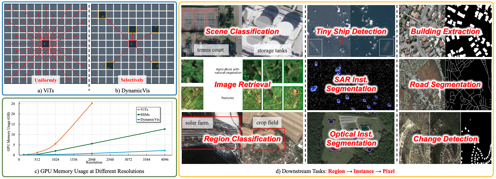

<div align="center">
    <h2>
       DynamicVis: An Efficient and General Visual Foundation Model for Remote Sensing Image Understanding
    </h2>
</div>
<br>

<div align="center">
  
</div>
<br>
<div align="center">
  <a href="https://github.com/KyanChen/DynamicVis">
    <span style="font-size: 20px; ">Homepage</span>
  </a>
  &nbsp;&nbsp;&nbsp;&nbsp;
  <a href="https://arxiv.org/abs/2501.xx">
    <span style="font-size: 20px; ">arXiv</span>
  </a>
  &nbsp;&nbsp;&nbsp;&nbsp;
  <a href="resources/DynamicVis.pdf">
    <span style="font-size: 20px; ">PDF</span>
  </a>
</div>
<br>
<br>

[](https://github.com/KyanChen/DynamicVis)
[](LICENSE)
[](https://arxiv.org/abs/2501.xxx)

<br>
<br>

<div align="center">

English | [简体中文](README_zh-CN.md)

</div>


## Introduction

This repository contains the official implementation of the paper [DynamicVis: An Efficient and General Visual Foundation Model for Remote Sensing Image Understanding](https://arxiv.org/abs/2501.xxx), developed based on the [OpenMMLab](https://openmmlab.com/codebase) framework.

DynamicVis is a dynamic visual perception foundation model for remote sensing, achieving efficient low-resource parsing of ultra-large images (2048x2048 pixels processing requires only 800MB GPU RAM) through a selective region-aware architecture and multi-instance meta-embedding learning. The model demonstrates exceptional performance across nine remote sensing downstream tasks, with ~20x computational efficiency and ~97% memory reduction compared to ViT, enabling cross-task understanding of high-resolution remote sensing imagery.

The current branch has been tested on Linux systems with PyTorch 2.x and CUDA 12.1, supporting Python 3.10+ and compatible with most CUDA versions.

If you find this project helpful, please give us a star ⭐️. Your support is our greatest motivation.


<details open>
<summary>Main Features</summary>

- API interfaces and usage methods highly consistent with OpenMMLab
- Open-sourced DynamicVis models and weights of different scales as described in the paper
- Supports fine-tuning and testing for nine remote sensing downstream tasks mentioned in the paper

</details>

## Changelog

🌟 **2025.03.20** Released DynamicVis project.

## TODO

- [ ] Organize DynamicVis pretraining code
- [ ] Upload DynamicVis model weights
- [ ] Sort out fine-tuning and testing code for nine tasks in the paper
- [ ] Upload DynamicVis model weights based on Mamba2


## Contents

- [Introduction](#introduction)
- [Changelog](#changelog)
- [TODO](#todo)
- [Table of Contents](#Contents)
- [Installation](#installation)
- [Dataset Preparation](#dataset-preparation)
- [Model Pretraining](#model-pretraining)
- [Model Fine-tuning](#model-fine-tuning)
- [Testing](#testing)
- [FAQ](#faq)
- [Acknowledgements](#acknowledgements)
- [Citation](#citation)
- [License](#license)
- [Contact](#contact)

## Installation

### Prerequisites

- Linux OS (Windows not supported for Mamba)
- Python 3.10+ (3.11 recommended)
- PyTorch 2.0+ (2.4 recommended)
- CUDA 11.7+ (12.1 recommended)
- MMCV 2.0+ (2.2 recommended)
- Mamba 2.2.4

### Environment Setup

We recommend using Miniconda for installation. The following commands will create a virtual environment named `dynamicvis` and install PyTorch and MMCV. The default CUDA version in these instructions is **12.1**. Modify accordingly if using a different CUDA version.

<details>

**Step 0**: Install [Miniconda](https://www.anaconda.com/docs/getting-started/miniconda/install).

**Step 1**: Create and activate a virtual environment:

```shell
conda create -n dynamicvis python=3.11 -y
conda activate dynamicvis
```

**Step 2**: Install [PyTorch 2.4.x](https://pytorch.org/get-started/previous-versions/).

Linux:

```shell
pip install torch==2.4.1 torchvision==0.19.1 torchaudio==2.4.1 --index-url https://download.pytorch.org/whl/cu121
```
OR
```shell
conda install pytorch==2.4.1 torchvision==0.19.1 torchaudio==2.4.1 pytorch-cuda=12.1 -c pytorch -c nvidia
```

**Step 3**: Install [MMCV 2.2.x](https://mmcv.readthedocs.io/en/latest/get_started/installation.html).

```shell
pip install -U openmim
mim install mmcv==2.2.0
# OR
pip install mmcv==2.2.0 -f https://download.openmmlab.com/mmcv/dist/cu121/torch2.4/index.html
```

**Step 4**: Install [causal-conv1d](https://github.com/Dao-AILab/causal-conv1d) and [Mamba 2.2.4](https://github.com/state-spaces/mamba):

```shell
# Install causal-conv1d
wget https://github.com/Dao-AILab/causal-conv1d/releases/download/v1.5.0.post8/causal_conv1d-1.5.0.post8+cu12torch2.4cxx11abiTRUE-cp311-cp311-linux_x86_64.whl
pip install causal_conv1d-1.5.0.post8+cu12torch2.4cxx11abiTRUE-cp311-cp311-linux_x86_64.whl

# Install mamba
wget https://github.com/state-spaces/mamba/releases/download/v2.2.4/mamba_ssm-2.2.4+cu12torch2.4cxx11abiTRUE-cp311-cp311-linux_x86_64.whl
pip install mamba_ssm-2.2.4+cu12torch2.4cxx11abiTRUE-cp311-cp311-linux_x86_64.whl
```

**Step 5**: Install other dependencies:

```shell
pip install ipdb -U
```

</details>


### Install DynamicVis

Clone the repository:

```shell
git clone git@github.com:KyanChen/DynamicVis.git
cd DynamicVis
```

## Dataset Preparation

<details>

### Pretraining Dataset

#### fMoW Dataset

##### Download

- Dataset: [fMoW Dataset](https://github.com/fMoW/dataset)
- Download the **fMoW-rgb** subset:

```shell
pip install awscli

# List files
aws s3 ls --no-sign-request s3://spacenet-dataset/Hosted-Datasets/fmow/fmow-rgb/

# Download
aws s3 sync --no-sign-request s3://spacenet-dataset/Hosted-Datasets/fmow/fmow-rgb/ ./data/fmow-rgb/
```

##### Organization

Organize data using [WebDataset](https://github.com/webdataset/webdataset):

```shell
python tools_DynamicVis/tools_data/fMoW/get_fmow_train_val_data.py
```

### Scene Classification Datasets

#### UC Merced Dataset

##### Download

- [UC Merced Dataset](http://weegee.vision.ucmerced.edu/datasets/landuse.html)

##### Directory Structure

```
${DATASET_ROOT}
├── airplane
│   ├── airplane01.tif
│   ├── airplane02.tif
│   └── ...
├── ...
└── ...
```

Use the provided [split script](tools_DynamicVis/tools_data/UCMerced/split_trainval.py) for dataset partitioning.

#### AID Dataset

##### Download

- [AID Dataset](https://www.kaggle.com/datasets/jiayuanchengala/aid-scene-classification-datasets)

##### Directory Structure

```
${DATASET_ROOT}
├── airplane
│   ├── airplane01.jpg
│   ├── airplane02.jpg
│   └── ...
├── ...
└── ...
```

Use the provided [split script](tools_DynamicVis/tools_data/AID/split_trainval.py) for dataset partitioning.

</details>

## Model Pretraining

### Config File Overview

Configuration files for different model sizes are available in [configs_DynamicVis/fMoW](configs_DynamicVis/fMoW). Key parameters include:

- `work_dir`: Output directory
- `data_root`: Dataset path (use absolute path)
- `batch_size`: Adjust based on GPU memory
- `max_epochs`: Training epochs
- `model/backbone`: DynamicVis backbone configuration

### Training Commands

```shell
# Single GPU
python tools_mmpretrain/train.py configs_DynamicVis/fMoW/name_to_config.py

# Multi-GPU
sh tools_mmpretrain/dist_train.sh configs_DynamicVis/fMoW/name_to_config.py ${GPU_NUM}
```

### Testing

```shell
# Single GPU
python tools_mmpretrain/test.py configs_DynamicVis/fMoW/name_to_config.py ${CHECKPOINT_FILE}

# Multi-GPU
sh tools_mmpretrain/dist_test.sh configs_DynamicVis/fMoW/name_to_config.py ${CHECKPOINT_FILE} ${GPU_NUM}
```

## Model Fine-tuning

### Scene Classification

#### Config Files

- UC Merced: [configs_DynamicVis/UCMerced](configs_DynamicVis/UCMerced)
- AID: [configs_DynamicVis/AID](configs_DynamicVis/AID)

### Fine-tuning

```shell
# Single GPU
python tools_mmpretrain/train.py configs_DynamicVis/UCMerced/name_to_config.py

# Multi-GPU
sh tools_mmpretrain/dist_train.sh configs_DynamicVis/UCMerced/name_to_config.py ${GPU_NUM}
```

### Testing

```shell
# Single GPU
python tools_mmpretrain/test.py configs_DynamicVis/UCMerced/name_to_config.py ${CHECKPOINT_FILE}

# Multi-GPU
sh tools_mmpretrain/dist_test.sh configs_DynamicVis/UCMerced/name_to_config.py ${CHECKPOINT_FILE} ${GPU_NUM}
```

## FAQ

<details>

**Q1**: Should I install MM series packages?
**A1**: No. We include all necessary components. Existing MM installations may cause conflicts.

**Q2**: How to resolve "Bad substitution" error in `dist_train.sh`?
**A2**: Run with `bash dist_train.sh` instead.

For more issues, please [open an issue](https://github.com/KyanChen/DynamicVis/issues).

</details>

## Acknowledgements

This project is built upon [OpenMMLab](https://openmmlab.com/codebase). We thank the OpenMMLab developers.

## Citation

If you use DynamicVis in your research, please cite:

```bibtex
@article{chen2025dynamicvis,
  title={DynamicVis: An Efficient and General Visual Foundation Model for Remote Sensing Image Understanding},
  author={Chen, Keyan and Liu, Chenyang and Chen, Bowen and Li, Wenyuan and Zou, Zhengxia and Shi, Zhenwei},
  journal={arXiv preprint arXiv:2501.xxxx},
  year={2025}
}
```

## License

This project is licensed under the [Apache 2.0 License](LICENSE).

## Contact

For further questions❓, feel free to contact us 👬